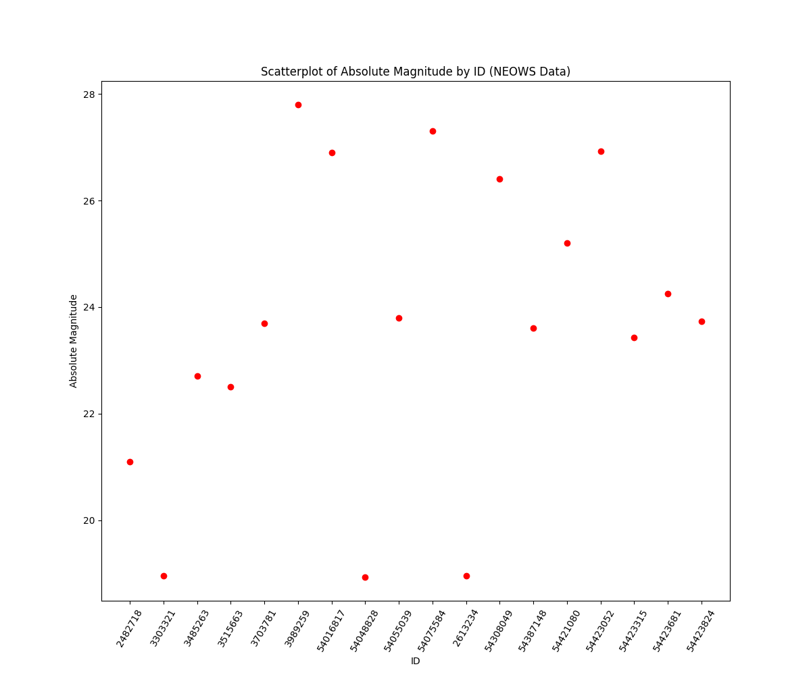

## About
This assignment uses data from the API Asteroids - NeoWs (NASA). We compute the mean of the `absolute_magnitude_h` from a selected date range. 

By [definition]((https://cneos.jpl.nasa.gov/glossary/h.html#:~:text=An%20asteroid's%20absolute%20magnitude%20is,at%20a%20zero%20phase%20angle)), an asteroid’s absolute magnitude is the visual magnitude an observer would record if the asteroid were placed 1 Astronomical Unit (au) away, 1 au from the Sun, and at a zero phase angle. 

**N.B:** This project uses `setup.py` instead of `pyproject.toml` to install due to a potential known [issue](https://github.com/pypa/hatch/issues/1113) of hatch .

Absolute Magnitude by ID on 2024-02-06:
